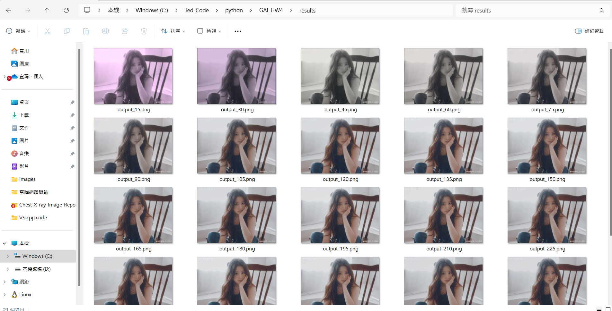

# GAI_HW4

## 執行需要安裝的套件
```bash
pip install torch torchvision pillow numpy
```

## 如何執行程式

執行主程式main.py，便會開始進行模型訓練
```bash
python main.py
```

## 查看結果

每15個epoch會儲存一次圖片，已寫好路徑將圖片儲存在資料夾results中
打開資料夾即可查看結果


